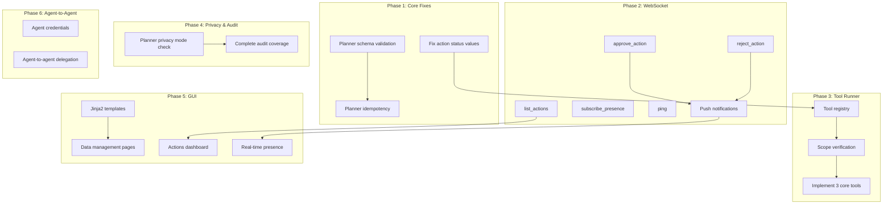

# Marvain Implementation Plan

> Generated: 2026-02-01  
> Based on: `MARVAIN_PRODUCTION_SPECIFICATIONS.md` v1.0  
> Current Test Status: **55/55 PASSING**

---

## Executive Summary

Marvain has a **solid foundation** with most infrastructure and core APIs implemented. The major gaps are:

| Gap Category | Severity | Scope |
|--------------|----------|-------|
| **Home GUI** | CRITICAL | Only auth + LiveKit test exist; need full home interface with remotes management |
| **Planner robustness** | HIGH | Schema validation, idempotency, rate limiting |
| **Tool Runner** | HIGH | Completely stubbed—no actual tool execution |
| **WebSocket APIs** | HIGH | Only `hello` implemented; 5 actions stubbed (needed for GUI) |
| **Privacy & Audit** | MEDIUM | Planner doesn't check privacy mode; audit coverage incomplete |
| **Agent-to-Agent** | LOW | Entire subsystem not implemented |

**Estimated Total Scope**: LARGE (5–7 weeks of focused work)

**Key Clarification**: The Home GUI is the primary user interface for interacting with marvain. It is NOT a CLI replacement — build/deploy/teardown remain CLI-only operations run by the system owner. The GUI provides the home interface for viewing/managing remotes (satellites), and accessing all marvain functionality.

---

## 1. Requirements Catalog

### 1.1 Infrastructure & Deployment (MUST)

| ID | Requirement | Status | Notes |
|----|-------------|--------|-------|
| I-1 | Aurora PostgreSQL Serverless v2 | ✅ Implemented | template.yaml lines 103–170 |
| I-2 | RDS Data API (no VPC Lambda) | ✅ Implemented | Using `rds_data.py` wrapper |
| I-3 | S3 Artifact bucket | ✅ Implemented | Non-locked bucket for artifacts |
| I-4 | S3 Audit bucket with Object Lock | ✅ Implemented | GOVERNANCE mode, 10-year retention |
| I-5 | API Gateway REST API | ✅ Implemented | HubApi resource |
| I-6 | API Gateway WebSocket API | ✅ Implemented | WsApi resource |
| I-7 | TranscriptQueue (SQS) | ✅ Implemented | Planner trigger |
| I-8 | ActionQueue (SQS) | ✅ Implemented | ToolRunner trigger |
| I-9 | DynamoDB connections table | ✅ Implemented | WsConnectionsTable |
| I-10 | Cognito User Pool | ✅ Implemented | With hosted UI |
| I-11 | Secrets Manager for API keys | ✅ Implemented | OpenAI, LiveKit secrets |

### 1.2 Database Schema (MUST)

| ID | Requirement | Status | Notes |
|----|-------------|--------|-------|
| D-1 | `agents` table | ✅ Implemented | sql/001_init.sql |
| D-2 | `spaces` table | ✅ Implemented | With privacy_mode column |
| D-3 | `devices` table | ✅ Implemented | With scopes JSONB |
| D-4 | `people` table | ✅ Implemented | |
| D-5 | `consent_grants` table | ✅ Implemented | |
| D-6 | `presence` table | ✅ Implemented | |
| D-7 | `events` table | ✅ Implemented | With embedding vector(1536) |
| D-8 | `memories` table | ✅ Implemented | episodic/semantic tier |
| D-9 | `actions` table | ✅ Implemented | State machine enum |
| D-10 | `audit_state` table | ✅ Implemented | Hash chain tracking |
| D-11 | `users` table | ✅ Implemented | sql/002 migration |
| D-12 | `agent_memberships` table | ✅ Implemented | With unique owner constraint |
| D-13 | pgcrypto extension | ✅ Implemented | For gen_random_uuid() |
| D-14 | pgvector extension | ✅ Implemented | For vector similarity |

### 1.3 Authentication & Authorization (MUST)

| ID | Requirement | Status | Notes |
|----|-------------|--------|-------|
| A-1 | Cognito access token validation | ✅ Implemented | `auth.py` authenticate_user_access_token |
| A-2 | Device token hash-based auth | ✅ Implemented | `auth.py` authenticate_device |
| A-3 | Device scope enforcement | ✅ Implemented | `auth.py` require_scopes |
| A-4 | Human membership RBAC | ✅ Implemented | `memberships.py` check_agent_permission |
| A-5 | Claim first owner flow | ✅ Implemented | With race-safe unique index |
| A-6 | Device registration | ✅ Implemented | API endpoint exists |
| A-7 | Agent credentials (device-like) | ❌ Not Implemented | Spec 3.3.1 |
| A-8 | Agent-to-agent delegation | ❌ Not Implemented | Spec 3.3.2 |

### 1.4 REST API Endpoints (MUST)

| ID | Requirement | Status | Notes |
|----|-------------|--------|-------|
| R-1 | GET /health | ✅ Implemented | |
| R-2 | GET /v1/me | ✅ Implemented | Returns user info |
| R-3 | GET /v1/agents | ✅ Implemented | List user's agents |
| R-4 | POST /v1/agents/{id}/claim_owner | ✅ Implemented | |
| R-5 | GET/POST/PATCH/DELETE memberships | ✅ Implemented | Full CRUD |
| R-6 | POST /v1/devices/register | ✅ Implemented | |
| R-7 | POST /v1/livekit/token | ✅ Implemented | |
| R-8 | POST /v1/events | ✅ Implemented | With SQS enqueue |
| R-9 | GET/DELETE /v1/memories | ✅ Implemented | |
| R-10 | POST /v1/artifacts/presign | ✅ Implemented | S3 presigned URL |
| R-11 | POST /v1/admin/bootstrap | ✅ Implemented | Admin-only |

### 1.5 WebSocket API (MUST)

| ID | Requirement | Status | Notes |
|----|-------------|--------|-------|
| W-1 | $connect handler | ✅ Implemented | Records connection in DynamoDB |
| W-2 | $disconnect handler | ✅ Implemented | Removes connection |
| W-3 | hello (auth) action | ✅ Implemented | Both user & device auth |
| W-4 | approve_action action | ❌ Stubbed | Returns generic ack |
| W-5 | reject_action action | ❌ Stubbed | Returns generic ack |
| W-6 | subscribe_presence action | ❌ Stubbed | Returns generic ack |
| W-7 | list_actions action | ❌ Stubbed | Returns generic ack |
| W-8 | ping action | ❌ Stubbed | Returns generic ack |
| W-9 | Push notifications to clients | ❌ Not Implemented | Spec 4.3 |

### 1.6 Planner (MUST)

| ID | Requirement | Status | Notes |
|----|-------------|--------|-------|
| P-1 | SQS trigger | ✅ Implemented | TranscriptQueue consumer |
| P-2 | Load event context from DB | ✅ Implemented | Recent events query |
| P-3 | Vector recall (pgvector) | ✅ Implemented | Cosine similarity search |
| P-4 | Call OpenAI Responses API | ✅ Implemented | `openai_http.py` |
| P-5 | Parse JSON output | ✅ Implemented | But no validation |
| P-6 | Schema validation | ❌ Not Implemented | Spec 5.4 |
| P-7 | Idempotency mechanism | ❌ Not Implemented | Spec 5.5 |
| P-8 | Insert memories with embeddings | ✅ Implemented | |
| P-9 | Create actions | ✅ Implemented | proposed or auto-approved |
| P-10 | Enqueue approved actions | ✅ Implemented | To ActionQueue |
| P-11 | Audit log planner results | ✅ Implemented | |
| P-12 | Rate limiting / backoff | ❌ Not Implemented | |

### 1.7 Tool Runner (MUST)

| ID | Requirement | Status | Notes |
|----|-------------|--------|-------|
| T-1 | SQS trigger | ✅ Implemented | ActionQueue consumer |
| T-2 | Load action from DB | ✅ Implemented | |
| T-3 | Check agent disabled | ✅ Implemented | policy.py |
| T-4 | Verify action is approved/executing | ✅ Implemented | |
| T-5 | Mark action as executing | ✅ Implemented | |
| T-6 | Execute tool | ❌ Stubbed | Placeholder only |
| T-7 | Scope verification before exec | ❌ Not Implemented | |
| T-8 | Mark action as executed | ⚠️ Partial | Uses "done" not "executed" |
| T-9 | Audit log execution | ✅ Implemented | |
| T-10 | Tool registry/manifest | ❌ Not Implemented | |

### 1.8 Audit & Compliance (MUST)

| ID | Requirement | Status | Notes |
|----|-------------|--------|-------|
| AU-1 | Hash-chained entries | ✅ Implemented | audit.py |
| AU-2 | S3 Object Lock writes | ✅ Implemented | |
| AU-3 | Postgres audit_state tracking | ✅ Implemented | |
| AU-4 | Log planning outputs | ✅ Implemented | |
| AU-5 | Log action executions | ✅ Implemented | |
| AU-6 | Log membership changes | ⚠️ Partial | Not all paths logged |
| AU-7 | Log device registration | ⚠️ Partial | Not all paths logged |

### 1.9 Privacy Controls (MUST)

| ID | Requirement | Status | Notes |
|----|-------------|--------|-------|
| PR-1 | Privacy mode per space | ✅ Implemented | policy.py is_privacy_mode |
| PR-2 | Agent disabled flag | ✅ Implemented | policy.py is_agent_disabled |
| PR-3 | Planner respects privacy mode | ❌ Not Implemented | |

### 1.10 Home GUI (CRITICAL)

**A rich, opinionated frontend UI is a CRITICAL GOAL** — the primary interface for interacting with marvain.

The GUI is:
- The **home interface** for all user interaction with marvain
- The entry point for viewing connected remotes (satellites), adding new remotes, and managing connections
- The comprehensive starting point for all marvain functionality
- **NOT** a replacement for the CLI — build/deploy/teardown remain CLI-only (run by system owner)
- The parent interface from which all other sub-interfaces derive

| ID | Requirement | Status | Notes |
|----|-------------|--------|-------|
| G-1 | GUI lifecycle commands | ✅ Implemented | start/stop/restart/status/logs all work |
| G-2 | Cognito OAuth login flow | ✅ Implemented | /login → Cognito → /callback |
| G-3 | Home page (list agents) | ✅ Implemented | Shows user's agents with roles |
| G-4 | Profile page | ✅ Implemented | Shows user_id and email |
| G-5 | Agent detail page | ✅ Implemented | Shows agent_id and role |
| G-6 | LiveKit test page | ✅ Implemented | Full WebRTC with chat |
| G-7 | Spaces management | ❌ Not Implemented | No list/create/edit spaces UI |
| G-8 | Devices management | ❌ Not Implemented | No list/register devices UI |
| G-9 | People & Consent UI | ❌ Not Implemented | No people/consent management |
| G-10 | Memories browser | ❌ Not Implemented | No list/delete memories UI |
| G-11 | Event stream viewer | ❌ Not Implemented | No event tail/filter UI |
| G-12 | Artifacts browser | ❌ Not Implemented | No artifact listing/upload UI |
| G-13 | Audit log viewer | ❌ Not Implemented | No audit chain browser |
| G-14 | Actions dashboard | ❌ Not Implemented | No pending actions / approve/reject UI |
| G-15 | WebSocket presence | ❌ Not Implemented | No real-time presence display |
| G-16 | HTTPS support | ✅ Implemented | --https flag with mkcert |
| G-17 | Remotes management | ❌ Not Implemented | No view/add/manage connected satellites |
| G-18 | Remote status display | ❌ Not Implemented | No online/offline status for remotes |

**Current GUI State**: Minimal but functional for auth + LiveKit testing. Missing home interface, remotes management, and all data management UIs.

---

## 2. Known Deficiencies (Section 11)

The specification explicitly calls out these deficiencies to eliminate:

| Deficiency | Current Status | Severity |
|------------|----------------|----------|
| **D11-1**: Failing test collection | ✅ FIXED | Tests now collect & pass (55/55) |
| **D11-2**: Runtime NameErrors in lambdas | ✅ FIXED | No import errors observed |
| **D11-3**: Unvalidated planner JSON output | ❌ OPEN | Schema validation missing |
| **D11-4**: Duplicate writes (no idempotency) | ❌ OPEN | Planner can double-write |
| **D11-5**: Stubbed WebSocket APIs | ❌ OPEN | 5 of 6 actions stubbed |
| **D11-6**: Tool runner placeholder | ❌ OPEN | No actual tool execution |

---

## 3. Acceptance Criteria (Section 12)

The specification defines these acceptance criteria for production readiness:

| Criterion | Status | Path to Completion |
|-----------|--------|-------------------|
| **AC-1**: All tests pass | ✅ DONE | 55/55 passing |
| **AC-2**: Clean deploy from scratch | 🔄 VERIFY | Need end-to-end test |
| **AC-3**: Cognito login → GUI → data flows | 🔄 VERIFY | Need integration test |
| **AC-4**: Device registers and ingests events | 🔄 VERIFY | Need integration test |
| **AC-5**: Planner produces valid outputs | ❌ TODO | Schema validation required |
| **AC-6**: Tool runner executes real tool | ❌ TODO | At least 1 tool required |
| **AC-7**: WebSocket actions functional | ❌ TODO | 5 stubbed actions |
| **AC-8**: Audit entries verifiable | 🔄 VERIFY | Hash chain works, need test |
| **AC-9**: Privacy mode blocks planner | ❌ TODO | Logic not implemented |
| **AC-10**: Agent disabled blocks execution | ✅ DONE | Implemented in tool_runner |

---

## 4. Dependency Graph

---

## 5. Phased Execution Plan

### Phase 1: Planner Robustness (HIGH PRIORITY)
**Duration**: 3–5 days
**Dependencies**: None

| Task | Description | Acceptance |
|------|-------------|------------|
| 1.1 | Add JSON Schema validation to planner | Planner rejects malformed LLM output |
| 1.2 | Add idempotency key (event_id + attempt) | Duplicate SQS messages don't double-write |
| 1.3 | Fix action status: "done" → "executed" | Matches spec state machine |
| 1.4 | Add basic rate limiting / exponential backoff | Handles OpenAI 429s gracefully |
| 1.5 | Add tests for all planner edge cases | ≥80% coverage on handler.py |

**Deliverables**:
- `planner_schema.json` defining output structure
- Updated `functions/planner/handler.py`
- New tests in `tests/test_planner.py`

### Phase 2: WebSocket API Completion (MEDIUM PRIORITY)
**Duration**: 4–6 days
**Dependencies**: Phase 1 (actions table consistency)

| Task | Description | Acceptance |
|------|-------------|------------|
| 2.1 | Implement `approve_action` | Updates action state, enqueues to ActionQueue |
| 2.2 | Implement `reject_action` | Updates action state to rejected |
| 2.3 | Implement `list_actions` | Returns pending actions for agent |
| 2.4 | Implement `subscribe_presence` | Stores subscription in DynamoDB |
| 2.5 | Implement `ping` | Returns pong with timestamp |
| 2.6 | Implement push notifications | Broadcasts to subscribed connections |
| 2.7 | Add WebSocket integration tests | All actions testable |

**Deliverables**:
- Updated `functions/ws_message/handler.py`
- New `functions/ws_broadcast/handler.py` (optional)
- Tests in `tests/test_ws_actions.py`

### Phase 3: Tool Runner Implementation (HIGH PRIORITY)
**Duration**: 5–7 days
**Dependencies**: Phase 1.3 (correct status values)

| Task | Description | Acceptance |
|------|-------------|------------|
| 3.1 | Design tool registry manifest | JSON schema for tool definitions |
| 3.2 | Implement scope verification | Tools require specific scopes |
| 3.3 | Implement `send_message` tool | Posts to WebSocket connections |
| 3.4 | Implement `create_memory` tool | Inserts semantic memory |
| 3.5 | Implement `http_request` tool | Makes authenticated HTTP calls |
| 3.6 | Add tool execution tests | Each tool has unit tests |
| 3.7 | Add audit logging for tool results | All executions audited |

**Deliverables**:
- `tool_manifest.json` with tool definitions
- Updated `functions/tool_runner/handler.py`
- New `layers/shared/python/agent_hub/tools/` package
- Tests in `tests/test_tool_runner.py`

### Phase 4: Privacy & Audit Completion (MEDIUM PRIORITY)
**Duration**: 2–3 days
**Dependencies**: Phase 1 (planner), Phase 3 (tools)

| Task | Description | Acceptance |
|------|-------------|------------|
| 4.1 | Planner checks privacy mode | No planning when space is private |
| 4.2 | Complete audit coverage | All membership/device ops logged |
| 4.3 | Add audit verification test | Can walk hash chain and verify |

**Deliverables**:
- Updated `functions/planner/handler.py`
- Updated audit calls throughout codebase
- Tests in `tests/test_audit.py`

### Phase 5: Home GUI (CRITICAL PRIORITY)
**Duration**: 10–14 days
**Dependencies**: Phase 2 (WebSocket for real-time updates)

This is the **primary user interface** for marvain — the home from which all interaction flows. Must be polished, intuitive, and comprehensive.

**Scope Clarification**:
- This is the HOME interface, not a CLI replacement
- Build/deploy/teardown remain CLI-only (system owner operations)
- All sub-interfaces derive from this home GUI

| Task | Description | Acceptance |
|------|-------------|------------|
| 5.1 | Design system & base template | Dark theme, responsive, accessible, color-blind friendly |
| 5.2 | **Home dashboard** | Central hub: status overview, quick actions, navigation to all features |
| 5.3 | **Remotes management** | View connected satellites, online/offline status, add new remotes |
| 5.4 | **Remote status display** | Real-time connection status for all satellites |
| 5.5 | Agents management | List agents, view details, manage memberships |
| 5.6 | Spaces management | List/create/edit spaces, set privacy mode, LiveKit room mapping |
| 5.7 | Devices management | List/register/revoke devices, show scopes |
| 5.8 | People & Consent UI | Manage people, consent grants (voice/face/recording) |
| 5.9 | Memories browser | List/filter/delete memories, show tiers & provenance |
| 5.10 | Event stream viewer | Real-time tail, filter by space/type/person |
| 5.11 | Actions dashboard | Pending actions, approve/reject workflow, execution history |
| 5.12 | Artifacts browser | List artifacts, presigned upload, download links |
| 5.13 | Audit log viewer | Browse hash-chained entries, verify integrity |
| 5.14 | WebSocket integration | Real-time presence, push notifications, live updates |
| 5.15 | LiveKit test enhancement | Improve existing page, integrate with home |
| 5.16 | Navigation & UX polish | Consistent nav, breadcrumbs, toast notifications, loading states |

**Deliverables**:
- `templates/` directory with Jinja2 templates (base, partials, pages)
- `static/css/marvain.css` — design system stylesheet
- `static/js/marvain.js` — utilities, WebSocket client, HTMX extensions
- Updated `functions/hub_api/app.py` with all GUI routes
- New API endpoints for GUI data access (remotes, spaces, devices, people, events, artifacts, audit)
- Tests for GUI routes in `tests/test_gui_app.py`

### Phase 6: Agent-to-Agent (LOW PRIORITY)
**Duration**: 5–7 days
**Dependencies**: Phases 1–5 complete

| Task | Description | Acceptance |
|------|-------------|------------|
| 6.1 | Add agent credentials table | Like devices, for agent principals |
| 6.2 | Implement agent credential issuance | Via owner/admin API |
| 6.3 | Implement agent-to-agent auth | Validate agent tokens |
| 6.4 | Implement delegation scopes | Agent can delegate subset of its scopes |
| 6.5 | Add agent-to-agent tests | Full auth flow tested |

**Deliverables**:
- SQL migration `004_agent_credentials.sql`
- Updated `layers/shared/python/agent_hub/auth.py`
- New API endpoints for agent credential management
- Tests in `tests/test_agent_credentials.py`

---

## 6. Phase Summary

| Phase | Duration | Priority | Risk | Blockers |
|-------|----------|----------|------|----------|
| **Phase 1**: Planner Robustness | 3–5 days | HIGH | Medium | None |
| **Phase 2**: WebSocket APIs | 4–6 days | HIGH | Low | None (needed for GUI) |
| **Phase 3**: Tool Runner | 5–7 days | HIGH | High | Tool design decisions |
| **Phase 4**: Privacy & Audit | 2–3 days | MEDIUM | Low | None |
| **Phase 5**: Home GUI | 10–14 days | CRITICAL | Medium | Design decisions |
| **Phase 6**: Agent-to-Agent | 5–7 days | LOW | Medium | Spec clarification needed |

**Total Estimated Duration**: 29–42 days (5–7 weeks)

### Recommended Execution Order

Given that the Home GUI is CRITICAL, consider this adjusted order:

1. **Phase 1** (Planner) — Foundation fixes
2. **Phase 2** (WebSocket) — Required for GUI real-time features
3. **Phase 5** (Home GUI) — Primary user interface ⭐
4. **Phase 3** (Tool Runner) — Can develop in parallel with GUI
5. **Phase 4** (Privacy & Audit) — Polish before production
6. **Phase 6** (Agent-to-Agent) — Future enhancement

---

## 7. High-Risk Items & Blockers

### Immediate Attention Required

1. **Home GUI Design System** (Phase 5) ⭐ CRITICAL
   - Must establish design tokens, component library, layout patterns
   - Recommend: Follow `~/.augment/rules/02_gui_rules.md` (dark theme, color-blind friendly)
   - Decision needed: HTMX vs more JS, template structure
   - Home interface is the root from which all sub-interfaces derive

2. **Remotes Architecture** (Phase 5) ⭐ CRITICAL
   - How are remotes (satellites) registered and discovered?
   - What data model represents remote connection state?
   - How do we detect online/offline status?

3. **Planner Schema Design** (Phase 1)
   - Must define exact JSON schema for planner output
   - Recommend: Start with minimal schema, expand incrementally

4. **Tool Selection** (Phase 3)
   - Which tools are essential for MVP?
   - Recommend: `send_message`, `create_memory`, `http_request`

5. **Rate Limiting Strategy** (Phase 1)
   - OpenAI can rate-limit at any time
   - Recommend: Exponential backoff with jitter, max 3 retries

### Clarification Needed

1. **Agent-to-Agent Scope Semantics** (Phase 6)
   - How are delegated scopes inherited/restricted?
   - Need spec clarification before implementation

---

## 8. Verification Checklist

After all phases complete, verify:

- [ ] `marvain deploy` succeeds from clean state
- [ ] `marvain init db` applies all migrations
- [ ] Cognito user can log in via hosted UI
- [ ] GUI displays user's agents after login
- [ ] Device can register and ingest events
- [ ] Planner produces valid, schema-conformant output
- [ ] Tool runner executes at least one real tool
- [ ] All 6 WebSocket actions work end-to-end
- [ ] Audit entries form valid hash chain
- [ ] Privacy mode prevents planner execution
- [ ] Agent disabled prevents tool execution
- [ ] All tests pass (target: ≥75 tests)

---

## Appendix A: File Change Inventory

### New Files to Create

| File | Phase | Purpose |
|------|-------|---------|
| `functions/planner/schema.json` | 1 | Planner output schema |
| `tests/test_planner.py` | 1 | Planner unit tests |
| `tests/test_ws_actions.py` | 2 | WebSocket action tests |
| `layers/shared/python/agent_hub/tools/__init__.py` | 3 | Tool package |
| `layers/shared/python/agent_hub/tools/registry.py` | 3 | Tool registry |
| `layers/shared/python/agent_hub/tools/send_message.py` | 3 | send_message tool |
| `layers/shared/python/agent_hub/tools/create_memory.py` | 3 | create_memory tool |
| `layers/shared/python/agent_hub/tools/http_request.py` | 3 | http_request tool |
| `tests/test_tool_runner.py` | 3 | Tool runner tests |
| `tests/test_audit.py` | 4 | Audit verification tests |
| `templates/base.html` | 5 | Base Jinja2 template with nav, design system |
| `templates/partials/nav.html` | 5 | Navigation component |
| `templates/partials/toast.html` | 5 | Toast notification component |
| `templates/home.html` | 5 | Home dashboard (root interface) |
| `templates/remotes.html` | 5 | Remotes management page |
| `templates/agents.html` | 5 | Agents list page |
| `templates/agent_detail.html` | 5 | Agent detail with memberships |
| `templates/spaces.html` | 5 | Spaces management page |
| `templates/devices.html` | 5 | Devices management page |
| `templates/people.html` | 5 | People & consent management |
| `templates/memories.html` | 5 | Memories browser page |
| `templates/events.html` | 5 | Event stream viewer |
| `templates/actions.html` | 5 | Actions dashboard |
| `templates/artifacts.html` | 5 | Artifacts browser |
| `templates/audit.html` | 5 | Audit log viewer |
| `static/css/marvain.css` | 5 | Design system stylesheet |
| `static/js/marvain.js` | 5 | Utilities, WebSocket client |
| `static/js/htmx.min.js` | 5 | HTMX library (vendored) |
| `sql/004_agent_credentials.sql` | 6 | Agent credentials table |
| `tests/test_agent_credentials.py` | 6 | Agent credential tests |

### Files to Modify

| File | Phases | Changes |
|------|--------|---------|
| `functions/planner/handler.py` | 1, 4 | Schema validation, idempotency, privacy check |
| `functions/tool_runner/handler.py` | 1, 3 | Status fix, real tool execution |
| `functions/ws_message/handler.py` | 2 | Implement all stubbed actions |
| `layers/shared/python/agent_hub/audit.py` | 4 | Additional audit points |
| `functions/hub_api/app.py` | 5 | GUI routes, Jinja2 integration |
| `functions/hub_api/api_app.py` | 5, 6 | New API endpoints for GUI + agent credentials |
| `layers/shared/python/agent_hub/auth.py` | 6 | Agent credential auth |

---

*End of Implementation Plan*

