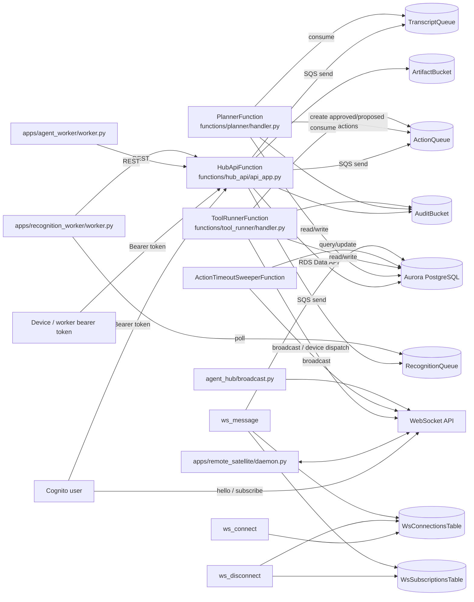

# OBJECTIVE

Grounded repo audit plus one upgrade path. I do **not** recommend replacing the runtime. The repo already has a workable AWS-native spine built around `template.yaml`, `functions/hub_api/api_app.py`, `functions/planner/handler.py`, `functions/tool_runner/handler.py`, Aurora via Data API, SQS, DynamoDB-backed WebSocket state, and S3-backed audit. The smallest viable transformation is to extend that spine, not add a second orchestrator. Proposed additions below are marked `NOT VERIFIED IN REPO`. `archive/` is excluded from active-runtime claims because `template.yaml` does not reference it.

Verified repo version note:
- **VERIFIED IN REPO**: embedded Git tags in the uploaded archive include `0.4.0`
- **VERIFIED IN REPO**: `git describe --tags --always` resolves to `0.4.0`
- **VERIFIED IN REPO**: `HEAD` resolves to commit `f5759313c621bcd24ab4803ca4e6bec62c279f1e`, which matches `refs/tags/0.4.0`
- **VERIFIED IN REPO**: `pyproject.toml` now uses SCM-managed dynamic versioning via `setuptools_scm`
- **VERIFIED IN REPO**: `dist/` still contains `marvain-0.3.11.tar.gz` and `marvain-0.3.11-py3-none-any.whl`
- Conclusion: the archive is Git-tagged `0.4.0`, and the checked-in packaging metadata is now aligned to SCM versioning even though old `dist/` artifacts remain

# PHASE 1 — REPO TRUTH AUDIT

## 1.1 System Inventory

- **services**
  - `functions/hub_api/lambda_handler.py` → `functions/hub_api/api_app.py`: Lambda-deployed REST API.
  - `functions/planner/handler.py`: SQS-driven planner.
  - `functions/tool_runner/handler.py`: SQS-driven tool execution worker.
  - `functions/action_timeout_sweeper/handler.py`: scheduled timeout worker.
  - `functions/ws_connect/handler.py`, `functions/ws_disconnect/handler.py`, `functions/ws_message/handler.py`: WebSocket control/auth/subscription plane.
  - `functions/hub_api/app.py`: local-only API + GUI; explicitly not Lambda-deployed.
  - `apps/agent_worker/worker.py`: external LiveKit/OpenAI realtime worker; not provisioned by `template.yaml`.
  - `apps/recognition_worker/worker.py`: external SQS recognition worker; not provisioned by `template.yaml`.
  - `apps/remote_satellite/daemon.py`: external remote device daemon; not provisioned by `template.yaml`.

- **modules**
  - Shared runtime lives in `layers/shared/python/agent_hub/`.
  - Core modules:
    - `rds_data.py`: Aurora Data API wrapper
    - `config.py`: env/config loader
    - `auth.py`: device, user, and agent-token auth
    - `memberships.py`: role checks and membership lifecycle
    - `policy.py`: agent disabled / privacy mode checks
    - `auto_approve_policy.py`: policy matcher for actions
    - `action_service.py`: action creation, approval, execution lifecycle, idempotency
    - `audit.py`: S3 audit append + hash chain
    - `broadcast.py`: WebSocket fanout
    - `openai_http.py`: OpenAI Responses + embeddings
    - `permission_service.py`: scope normalization and tool-runner scopes
    - `livekit_tokens.py`: LiveKit token minting
    - `contracts/tools.py`, `contracts/ws.py`: typed payload models
    - `tools/*.py`: current executable tool modules

- **entrypoints**
  - `functions/hub_api/lambda_handler.py:handler`
  - `functions/planner/handler.py:handler`
  - `functions/tool_runner/handler.py:handler`
  - `functions/action_timeout_sweeper/handler.py:handler`
  - `functions/ws_connect/handler.py:handler`
  - `functions/ws_disconnect/handler.py:handler`
  - `functions/ws_message/handler.py:handler`
  - `marvain_cli/__main__.py:main`
  - `pyproject.toml` registers console script `marvain = "marvain_cli.__main__:main"`

- **infra**
  - `template.yaml` is AWS SAM, not CDK.
  - It provisions:
    - VPC + private subnets + DB security group
    - Aurora PostgreSQL Serverless v2 with `StorageEncrypted: true`
    - `ArtifactBucket`
    - `AuditBucket` with `ObjectLockEnabled: true` and 3650-day governance retention
    - SQS: `TranscriptQueue`, `ActionQueue`, `RecognitionQueue`
    - DynamoDB: `WsConnectionsTable`, `WsSubscriptionsTable`
    - REST API Gateway, WebSocket API Gateway
    - Cognito user pool, clients, optional Google IdP
    - CloudWatch dashboard + alarms
    - 7 Lambda functions

- **data stores**
  - Aurora schema is in `sql/001_init.sql` through `sql/016_action_idempotency.sql`.
  - `sql/001_init.sql` enables `pgcrypto` and `vector`.
  - Main tables: `agents`, `spaces`, `devices`, `people`, `consent_grants`, `presence`, `events`, `memories`, `actions`, `audit_state`.
  - Extended tables: `users`, `agent_memberships`, `agent_tokens`, `action_auto_approve_policies`, `action_policy_decisions`, `person_accounts`, `voiceprints`, `faceprints`.
  - DynamoDB tables hold WebSocket connection and subscription state.
  - S3 holds artifacts and immutable audit objects.
  - Secrets Manager stores DB creds, admin API key, OpenAI, LiveKit, Google OAuth for Cognito, and session secret.

- **messaging**
  - SQS:
    - `TranscriptQueue` feeds `PlannerFunction`
    - `ActionQueue` feeds `ToolRunnerFunction`
    - `RecognitionQueue` feeds external `apps/recognition_worker/worker.py`
  - WebSocket API:
    - auth via `hello`
    - subscriptions for `events`, `actions`, `presence`, `memories`
    - device callbacks for `device_action_ack` and `device_action_result`
  - LiveKit support exists via `/v1/livekit/token`, `/v1/livekit/device-token`, `apps/agent_worker/worker.py`, and `apps/remote_satellite/location_node.py`

- **agent components**
  - Planner: `functions/planner/handler.py`
  - Tool registry/execution: `layers/shared/python/agent_hub/tools/registry.py`, `functions/tool_runner/handler.py`
  - Memory: `events`, `memories`, `/v1/memories`, `/v1/recall`, planner memory writes
  - Identity: Cognito users, device tokens, agent tokens, memberships, person-account links
  - Policy: privacy mode, disabled agents, auto-approve policies, scope checks
  - Audit: `audit.py` + `AuditBucket` + `audit_state`
  - Device plane: WebSocket functions + remote satellite daemon

## 1.2 Capability Mapping

- **agent loop**
  - **PARTIAL**
  - Files: `functions/planner/handler.py`, `functions/planner/schema.json`, `functions/planner/validation.py`
  - Truth: planner consumes only `TranscriptQueue` messages generated from `POST /v1/events` when `type == "transcript_chunk"`. Prompt and extraction are transcript-centric. Output shape is `episodic[]`, `semantic[]`, `actions[]`.

- **tools**
  - **IMPLEMENTED**
  - Files: `layers/shared/python/agent_hub/tools/registry.py`, `layers/shared/python/agent_hub/tools/*.py`, `layers/shared/python/agent_hub/contracts/tools.py`
  - Active tool contracts in repo:
    - `send_message`
    - `create_memory`
    - `http_request`
    - `device_command`
    - `host_process`
    - `shell_command`
  - `host_process` is registered but intentionally non-executable in Lambda and returns `host_process_requires_local_executor`.

- **memory**
  - **IMPLEMENTED**
  - Files: `sql/001_init.sql`, `sql/012_rich_memories.sql`, `functions/hub_api/api_app.py`, `functions/planner/handler.py`
  - Truth: event ingestion, memory creation, pgvector embeddings, semantic recall, rich memory metadata, person-linked memory fields.

- **identity**
  - **IMPLEMENTED**
  - Files: `layers/shared/python/agent_hub/auth.py`, `layers/shared/python/agent_hub/memberships.py`, `sql/002_users_and_memberships.sql`, `sql/004_agent_tokens.sql`, `sql/013_person_accounts.sql`, `template.yaml`
  - Truth: Cognito-backed users, device bearer tokens, agent-to-agent tokens, per-agent memberships, person-account linking.

- **policy**
  - **PARTIAL**
  - Files: `layers/shared/python/agent_hub/policy.py`, `layers/shared/python/agent_hub/auto_approve_policy.py`, `layers/shared/python/agent_hub/action_service.py`
  - Truth: privacy mode, disabled agent checks, auto-approve policies, action approval sources, and scope enforcement exist.
  - Concrete gap: `action_service.prepare_action_request()` validates known tool kind and payload but does **not** automatically union `ToolSpec.required_scopes` into `actions.required_scopes`. That makes tool registry scopes and persisted action scopes separable.

- **audit**
  - **IMPLEMENTED**
  - Files: `layers/shared/python/agent_hub/audit.py`, `sql/001_init.sql`, `template.yaml`
  - Truth: audit entries are written to `AuditBucket` and chained by `audit_state.last_hash`.

- **background jobs**
  - **IMPLEMENTED**
  - Files: `functions/planner/handler.py`, `functions/tool_runner/handler.py`, `functions/action_timeout_sweeper/handler.py`, `apps/recognition_worker/worker.py`
  - Truth: planner and tool runner are SQS-driven; timeout sweeper is scheduled; recognition worker is external and polls SQS.

- **real-time interfaces**
  - **IMPLEMENTED**
  - Files: `functions/ws_connect/handler.py`, `functions/ws_disconnect/handler.py`, `functions/ws_message/handler.py`, `layers/shared/python/agent_hub/broadcast.py`, `apps/remote_satellite/daemon.py`, `apps/remote_satellite/location_node.py`
  - Truth: WS auth/subscriptions/device callbacks are live; events/actions/presence/memories fanout exists; remote devices can execute commands; LiveKit tokens exist.

- **integrations**
  - **PARTIAL**
  - **IMPLEMENTED**: OpenAI (`layers/shared/python/agent_hub/openai_http.py`), LiveKit (`layers/shared/python/agent_hub/livekit_tokens.py`, `apps/agent_worker/worker.py`, `apps/remote_satellite/location_node.py`), Cognito and optional Google login federation (`template.yaml`, `auth.py`, `cognito.py`)
  - **NOT PRESENT**: Slack, Gmail API, GitHub API, Linear API, Twilio SMS, Ramp
  - Important clarification: `template.yaml` defines `GoogleOAuthSecret`, but that is used for Cognito federation, not Gmail integration.

## 1.3 Architecture Diagram



# PHASE 2 — GAP ANALYSIS

## Integrations

- **Slack**
  - **NOT PRESENT**
  - No Slack runtime code in active paths `functions/`, `layers/shared/python/agent_hub/`, `apps/`, `sql/`, or `template.yaml`.

- **Gmail**
  - **NOT PRESENT**
  - No Gmail API client, poller, mailbox schema, webhook route, or send/draft tool.
  - `GoogleOAuthSecret` in `template.yaml` is only for Cognito Google federation.

- **GitHub**
  - **NOT PRESENT**
  - No webhook normalization, comment tool, issue/PR schema, or token store.

- **Linear**
  - **NOT PRESENT**
  - No webhook normalization, comment tool, issue schema, or token store.

- **SMS / Twilio**
  - **NOT PRESENT**
  - No Twilio webhook, no outbound SMS tool, no phone-number routing model.

- **Ramp**
  - **NOT PRESENT**
  - Optional in objective; no runtime support exists.

## Agent

- **summarize**
  - **PARTIAL**
  - Current planner summarizes transcript events into episodic/semantic memories in `functions/planner/handler.py`.

- **triage**
  - **NOT PRESENT**
  - No normalized inbox/work-item/message model, no triage status model, no Slack/Gmail/GitHub/Linear classifier loop.

- **draft**
  - **NOT PRESENT**
  - No draft model or draft-producing tools for Gmail, Slack, GitHub, Linear, SMS.

- **act**
  - **IMPLEMENTED** for built-in internal/device actions only
  - Files: `functions/tool_runner/handler.py`, `layers/shared/python/agent_hub/tools/*.py`
  - Current action kinds are internal notification, memory write, HTTP request, device command, shell command, host-process marker.

- **approvals**
  - **IMPLEMENTED**
  - Files: `sql/010_action_auto_approve_policy.sql`, `action_service.py`, `functions/ws_message/handler.py`, local-only `functions/hub_api/app.py`
  - Caveat: Lambda API has no public `/v1/actions/{id}/approve|reject` route. Approvals exist over WebSocket and local GUI/control routes.

- **permissioned tool use**
  - **PARTIAL**
  - Registry scopes exist, action scopes exist, device scopes exist.
  - Gap: registry required scopes are not automatically bound into the persisted action record.

## System

- **self-hosted**
  - **PARTIAL**
  - Core hub is deployable to a user-owned AWS account via `template.yaml`.
  - External workers `apps/agent_worker/worker.py` and `apps/recognition_worker/worker.py` are not provisioned by the SAM stack.

- **AWS-native**
  - **IMPLEMENTED**
  - SAM, Aurora, SQS, DynamoDB, S3, Cognito, API Gateway, CloudWatch.

- **secure**
  - **PARTIAL**
  - Implemented:
    - Aurora encryption at rest via `template.yaml` `StorageEncrypted: true`
    - hashed device and agent tokens in DB (`auth.py`, `sql/001_init.sql`, `sql/004_agent_tokens.sql`)
    - Cognito user auth
    - private subnets for Aurora
    - SSRF guards in `tools/http_request.py`
    - immutable audit bucket with Object Lock
  - Gaps:
    - no connector credential model
    - no connector-specific RBAC
    - no explicit KMS CMK resources in `template.yaml`
    - bucket default SSE settings are **NOT VERIFIED IN REPO**
    - generic `http_request` and `shell_command` are too broad for regulated connector actions

- **auditable**
  - **IMPLEMENTED**
  - Action lifecycle, planner result, event ingestion, memory writes, and privacy toggles already generate audit entries when `AUDIT_BUCKET` is configured.

- **idempotent**
  - **PARTIAL**
  - Implemented:
    - action idempotency in `sql/016_action_idempotency.sql` and `action_service.py`
    - WS `cmd.run_action` and `cmd.config` require idempotency keys in `functions/ws_message/handler.py`
  - Gap:
    - planner cross-invocation dedupe checks only `memories.provenance->>'source_event_id'`
    - if a planner run emits actions but no memories, duplicate cross-invocation action creation is possible

## Compliance readiness

- **PHI boundaries**
  - **PARTIAL**
  - Files: `policy.py`, `sql/001_init.sql`, `sql/014_biometrics.sql`, `template.yaml`
  - Implemented:
    - privacy mode at space level
    - consent grants
    - biometric vectors stored instead of raw long-lived assets
    - recognition artifacts under `recognition/` expire after 1 day in `ArtifactBucket`
  - Gaps:
    - no PHI data-class tagging on events/messages/actions
    - no connector-specific PHI routing controls
    - no redaction or retention worker for DB content

- **audit**
  - **IMPLEMENTED**
  - Hash-chained audit objects in Object Lock S3 plus `audit_state`.

- **RBAC**
  - **IMPLEMENTED**
  - User memberships, device scopes, agent tokens, and WS live membership checks.

- **retention**
  - **PARTIAL**
  - Implemented:
    - audit retention in S3
    - recognition artifact lifecycle
  - Missing:
    - general retention for `events`, `memories`, future connector messages, and drafts

- **HIPAA / CLIA adaptability**
  - **PARTIAL**
  - Repo has useful primitives, but legal/process controls, BAA posture, validation packages, SOPs, and connector-side PHI governance are **NOT VERIFIED IN REPO**.

# PHASE 3 — TARGET ARCHITECTURE (ONE ONLY)

## Planes

I recommend one path only: **extend the current SAM stack and reuse the existing `events -> planner -> actions -> tool_runner -> audit` pipeline. Do not introduce Step Functions, EventBridge, or a second planner service.** They are absent from the repo and would duplicate working primitives.

- **control plane**
  - Keep `functions/hub_api/api_app.py` as the single REST ingress.
  - Keep `functions/ws_message/handler.py` for approvals and live status.
  - Add integration-account CRUD routes in `api_app.py`. `[NOT VERIFIED IN REPO]`

- **data plane**
  - Keep Aurora as source of truth.
  - Add `integration_accounts`, `integration_messages`, and `integration_sync_state` in new SQL migrations. `[NOT VERIFIED IN REPO]`
  - Keep `AuditBucket` as immutable audit sink.
  - Keep `ArtifactBucket` only for binary artifacts; do not use it as a general message store.

- **execution plane**
  - Keep `PlannerFunction`, `ToolRunnerFunction`, and `ActionTimeoutSweeperFunction`.
  - Add one new SQS queue, `IntegrationQueue`, feeding the existing planner. `[NOT VERIFIED IN REPO]`
  - Add one scheduled `GmailPollFunction` for Gmail ingress. `[NOT VERIFIED IN REPO]`
  - Keep remote satellites and agent worker unchanged.

- **identity plane**
  - Keep Cognito users, device tokens, and agent tokens.
  - Add `integration_accounts.credentials_secret_arn` pointing to Secrets Manager JSON for provider credentials. `[NOT VERIFIED IN REPO]`
  - Trade-off: first cut uses manually provisioned secrets, not a new OAuth UI. That is smaller and consistent with current repo patterns.

- **policy plane**
  - Keep `privacy_mode`, `consent_grants`, auto-approve policies, and action approvals.
  - Fix `action_service.py` so persisted `actions.required_scopes` always include the tool registry scopes.
  - For regulated deployments, remove `http:request` and `shell:execute` from default planner-executable scopes.

## Agent model

- **planner**
  - Keep one planner in `functions/planner/handler.py`.
  - Extend it to consume both transcript events and normalized integration events of type `integration.event.received`. `[NOT VERIFIED IN REPO]`

- **tools**
  - Keep the current module-based tool registry.
  - Add typed connector tools under `layers/shared/python/agent_hub/tools/`. `[NOT VERIFIED IN REPO]`
  - Do **not** implement Slack/GitHub/Linear/Twilio/Gmail through the generic `http_request` tool. That would destroy provider-specific RBAC, action reviewability, and audit clarity.

- **memory**
  - Keep current `events` and `memories`.
  - Store external inbound records first as normalized `integration_messages`, then emit one `events` row pointing at that record. `[NOT VERIFIED IN REPO]`

- **events**
  - New normalized event type: `integration.event.received`. `[NOT VERIFIED IN REPO]`
  - Planner input should include provider, channel type, object type, sender, subject, text body, and recent thread context from `integration_messages`.

- **approvals**
  - All outbound provider actions still go through `create_action()` and current approval policy machinery.
  - Auto-approve remains controlled by `action_auto_approve_policies`.

## Integration strategy

- **auth**
  - Store provider credentials in Secrets Manager; reference them from `integration_accounts.credentials_secret_arn`. `[NOT VERIFIED IN REPO]`
  - No first-cut OAuth UI.

- **ingestion**
  - Slack, GitHub, Linear, Twilio: webhook routes in `functions/hub_api/api_app.py`. `[NOT VERIFIED IN REPO]`
  - Gmail: scheduled poller in `functions/gmail_poll/handler.py`. `[NOT VERIFIED IN REPO]`

- **normalization**
  - Every inbound item becomes:
    1. one row in `integration_messages`
    2. one row in existing `events` with `type = 'integration.event.received'`
    3. one SQS message on `IntegrationQueue`
  - That keeps a single planner/action pipeline.

- **idempotency**
  - Every inbound item gets a provider-derived `dedupe_key` stored in `integration_messages` with a unique `(agent_id, dedupe_key)` constraint. `[NOT VERIFIED IN REPO]`
  - Every planner-created action should also get a deterministic idempotency key derived from `event_id`, action index, and kind. `[NOT VERIFIED IN REPO]`

## SMS interface

- **inbound webhook**
  - Add `POST /v1/integrations/twilio/webhook/{integration_account_id}` in `functions/hub_api/api_app.py`. `[NOT VERIFIED IN REPO]`
  - Verify provider signature, normalize into `integration_messages`, create `integration.event.received`, enqueue planner.

- **routing**
  - Route SMS to the owning `agent_id` through `integration_account_id`.
  - Optional `default_space_id` should live in `integration_accounts.config`. `[NOT VERIFIED IN REPO]`

- **constraints**
  - v1 should be text-only SMS.
  - MMS/media ingestion is **NOT VERIFIED IN REPO** and should not be included in the first cut.

- **outbound**
  - Add `twilio_send_sms` tool executed by `ToolRunnerFunction`. `[NOT VERIFIED IN REPO]`
  - Outbound SMS still requires normal action approval and audit.

# PHASE 4 — IMPLEMENTATION SPEC (CODEX READY)

## Phases

### A: core runtime

- **file paths**
  - Modify `template.yaml`
    - add `IntegrationQueue` `[NOT VERIFIED IN REPO]`
    - add `INTEGRATION_QUEUE_URL` to `HubApiFunction` and `PlannerFunction` `[NOT VERIFIED IN REPO]`
    - add second SQS event source on `PlannerFunction` for `IntegrationQueue` `[NOT VERIFIED IN REPO]`
  - Modify `layers/shared/python/agent_hub/config.py`
    - add `integration_queue_url` to `HubConfig` and `load_config()` `[NOT VERIFIED IN REPO]`
  - Add `sql/017_integrations.sql` `[NEW, NOT VERIFIED IN REPO]`
  - Add `sql/018_integration_messages.sql` `[NEW, NOT VERIFIED IN REPO]`
  - Add `sql/019_integration_sync_state.sql` `[NEW, NOT VERIFIED IN REPO]`
  - Add `layers/shared/python/agent_hub/integrations/models.py` `[NEW, NOT VERIFIED IN REPO]`
  - Add `layers/shared/python/agent_hub/integrations/store.py` `[NEW, NOT VERIFIED IN REPO]`
  - Modify `functions/hub_api/api_app.py`
    - add integration-account CRUD
    - add helper to write `integration_messages` and synthetic `events`
  - Modify `functions/planner/handler.py`
    - branch on `event.type == 'integration.event.received'`
  - Modify `layers/shared/python/agent_hub/action_service.py`
    - bind tool registry scopes into persisted action scopes

- **endpoints**
  - `GET /v1/agents/{agent_id}/integrations` `[NOT VERIFIED IN REPO]`
  - `POST /v1/agents/{agent_id}/integrations` `[NOT VERIFIED IN REPO]`
  - `PATCH /v1/agents/{agent_id}/integrations/{integration_account_id}` `[NOT VERIFIED IN REPO]`
  - `DELETE /v1/agents/{agent_id}/integrations/{integration_account_id}` `[NOT VERIFIED IN REPO]`

- **schemas**
  - `IntegrationAccountCreateIn` `[NOT VERIFIED IN REPO]`
    - `provider: Literal["slack","gmail","github","linear","twilio"]`
    - `display_name: str`
    - `external_account_id: str | None = None`
    - `default_space_id: str | None = None`
    - `credentials_secret_arn: str`
    - `scopes: list[str] = []`
    - `config: dict[str, Any] = {}`
  - `IntegrationAccountPatchIn` `[NOT VERIFIED IN REPO]`
    - `display_name: str | None = None`
    - `default_space_id: str | None = None`
    - `scopes: list[str] | None = None`
    - `config: dict[str, Any] | None = None`
    - `status: Literal["active","paused","revoked"] | None = None`

- **workers**
  - `PlannerFunction` remains the only planner worker.
  - `ToolRunnerFunction` remains the only action executor.
  - `ActionTimeoutSweeperFunction` remains unchanged for device actions.

### B: integrations

- **file paths**
  - Add `layers/shared/python/agent_hub/integrations/base.py` `[NEW, NOT VERIFIED IN REPO]`
  - Add `layers/shared/python/agent_hub/integrations/slack.py` `[NEW, NOT VERIFIED IN REPO]`
  - Add `layers/shared/python/agent_hub/integrations/gmail.py` `[NEW, NOT VERIFIED IN REPO]`
  - Add `layers/shared/python/agent_hub/integrations/github.py` `[NEW, NOT VERIFIED IN REPO]`
  - Add `layers/shared/python/agent_hub/integrations/linear.py` `[NEW, NOT VERIFIED IN REPO]`
  - Add `layers/shared/python/agent_hub/integrations/twilio.py` `[NEW, NOT VERIFIED IN REPO]`
  - Add `functions/gmail_poll/handler.py` `[NEW, NOT VERIFIED IN REPO]`
  - Modify `functions/hub_api/api_app.py`
    - add webhook routes
    - do not add these to `functions/hub_api/app.py`; Lambda ingress belongs in `api_app.py`

- **endpoints**
  - `POST /v1/integrations/slack/webhook/{integration_account_id}` `[NOT VERIFIED IN REPO]`
  - `POST /v1/integrations/github/webhook/{integration_account_id}` `[NOT VERIFIED IN REPO]`
  - `POST /v1/integrations/linear/webhook/{integration_account_id}` `[NOT VERIFIED IN REPO]`
  - `POST /v1/integrations/twilio/webhook/{integration_account_id}` `[NOT VERIFIED IN REPO]`

- **schemas**
  - `NormalizedIntegrationEvent` `[NOT VERIFIED IN REPO]`
    - `agent_id: str`
    - `space_id: str | None`
    - `integration_account_id: str`
    - `provider: Literal["slack","gmail","github","linear","twilio"]`
    - `channel_type: str`
    - `object_type: str`
    - `external_thread_id: str | None`
    - `external_message_id: str | None`
    - `sender: dict[str, Any]`
    - `recipients: list[dict[str, Any]]`
    - `subject: str | None`
    - `body_text: str`
    - `body_html: str | None`
    - `payload: dict[str, Any]`
    - `contains_phi: bool = False`
    - `dedupe_key: str`
  - Provider secret JSON shapes `[NOT VERIFIED IN REPO]`
    - Slack: `{"bot_token": "...", "signing_secret": "..."}`
    - Gmail: `{"client_id": "...", "client_secret": "...", "refresh_token": "...", "user_email": "..."}`
    - GitHub: `{"token": "...", "webhook_secret": "..."}`
    - Linear: `{"api_key": "...", "webhook_secret": "..."}`
    - Twilio: `{"account_sid": "...", "auth_token": "...", "messaging_service_sid": "...", "from_number": "+1..."}`

- **workers**
  - `HubApiFunction` handles webhook verification + normalization + DB insert + enqueue.
  - `GmailPollFunction` `[NOT VERIFIED IN REPO]`
    - load active Gmail integration accounts
    - load cursor from `integration_sync_state`
    - poll mailbox
    - insert `integration_messages`
    - create synthetic `events`
    - enqueue `IntegrationQueue`
    - update cursor only after successful DB commit

### C: agent layer

- **file paths**
  - Modify `functions/planner/handler.py`
    - add branch for `integration.event.received`
    - build planner prompt from normalized message fields plus recent thread history
    - set deterministic planner action idempotency keys `[NOT VERIFIED IN REPO]`
  - Modify `layers/shared/python/agent_hub/action_service.py`
    - `effective_required_scopes = normalize_scopes(caller_scopes ∪ registry.required_scopes)` `[NOT VERIFIED IN REPO]`
  - Modify `layers/shared/python/agent_hub/contracts/tools.py`
    - add connector payload models `[NOT VERIFIED IN REPO]`
  - Modify `layers/shared/python/agent_hub/permission_service.py`
    - add `message:triage` and connector scopes `[NOT VERIFIED IN REPO]`

- **endpoints**
  - No new planner endpoint required.
  - Reuse existing approvals:
    - WS `approve_action`, `reject_action`
    - auto-approve policy REST endpoints already exist in `api_app.py`

- **schemas**
  - Keep `functions/planner/schema.json` top-level shape unchanged:
    - `episodic[]`
    - `semantic[]`
    - `actions[]`
  - Allowed planner action kinds for integration events should be:
    - `set_message_status` `[NOT VERIFIED IN REPO]`
    - `slack_post_message` `[NOT VERIFIED IN REPO]`
    - `gmail_create_draft` `[NOT VERIFIED IN REPO]`
    - `gmail_send_message` `[NOT VERIFIED IN REPO]`
    - `github_issue_comment` `[NOT VERIFIED IN REPO]`
    - `linear_comment_create` `[NOT VERIFIED IN REPO]`
    - `twilio_send_sms` `[NOT VERIFIED IN REPO]`

- **workers**
  - `PlannerFunction` remains the only planner.
  - `ToolRunnerFunction` remains the only executor.

### D: messaging

- **file paths**
  - Add `layers/shared/python/agent_hub/tools/set_message_status.py` `[NEW, NOT VERIFIED IN REPO]`
  - Add `layers/shared/python/agent_hub/tools/slack_post_message.py` `[NEW, NOT VERIFIED IN REPO]`
  - Add `layers/shared/python/agent_hub/tools/gmail_create_draft.py` `[NEW, NOT VERIFIED IN REPO]`
  - Add `layers/shared/python/agent_hub/tools/gmail_send_message.py` `[NEW, NOT VERIFIED IN REPO]`
  - Add `layers/shared/python/agent_hub/tools/github_issue_comment.py` `[NEW, NOT VERIFIED IN REPO]`
  - Add `layers/shared/python/agent_hub/tools/linear_comment_create.py` `[NEW, NOT VERIFIED IN REPO]`
  - Add `layers/shared/python/agent_hub/tools/twilio_send_sms.py` `[NEW, NOT VERIFIED IN REPO]`
  - Modify `functions/hub_api/api_app.py`
    - add normalized message read endpoints `[NOT VERIFIED IN REPO]`

- **endpoints**
  - `GET /v1/agents/{agent_id}/messages` `[NOT VERIFIED IN REPO]`
    - filters: `provider`, `status`, `external_thread_id`, `limit`
  - `GET /v1/agents/{agent_id}/messages/{integration_message_id}` `[NOT VERIFIED IN REPO]`

- **schemas**
  - `SetMessageStatusPayload` `[NOT VERIFIED IN REPO]`
    - `integration_message_id: str`
    - `status: Literal["triaged","drafted","ignored","error"]`
    - `reason: str | None = None`
  - `SlackPostMessagePayload` `[NOT VERIFIED IN REPO]`
    - `integration_account_id: str`
    - `channel_id: str`
    - `text: str`
    - `thread_id: str | None = None`
  - `GmailCreateDraftPayload` `[NOT VERIFIED IN REPO]`
    - `integration_account_id: str`
    - `to: list[str]`
    - `cc: list[str] = []`
    - `bcc: list[str] = []`
    - `subject: str`
    - `body_text: str`
    - `thread_id: str | None = None`
  - `GmailSendMessagePayload` `[NOT VERIFIED IN REPO]`
    - same as draft payload, plus `draft_id: str | None = None`
  - `GitHubIssueCommentPayload` `[NOT VERIFIED IN REPO]`
    - `integration_account_id: str`
    - `repository: str`
    - `issue_number: int`
    - `body: str`
  - `LinearCommentCreatePayload` `[NOT VERIFIED IN REPO]`
    - `integration_account_id: str`
    - `issue_id: str`
    - `body: str`
  - `TwilioSendSmsPayload` `[NOT VERIFIED IN REPO]`
    - `integration_account_id: str`
    - `to: str`
    - `body: str`

- **workers**
  - `ToolRunnerFunction` executes all outbound messaging actions and writes the resulting provider IDs back to `integration_messages`. `[NOT VERIFIED IN REPO]`

### E: compliance

- **file paths**
  - Add `functions/retention_sweeper/handler.py` `[NEW, NOT VERIFIED IN REPO]`
  - Modify `template.yaml`
    - add `RetentionSweeperFunction` scheduled daily `[NOT VERIFIED IN REPO]`
  - Modify `layers/shared/python/agent_hub/audit.py`
    - add integration-specific audit entry types `[NOT VERIFIED IN REPO]`
  - Modify `layers/shared/python/agent_hub/permission_service.py`
    - default regulated scope profile should omit `http:request` and `shell:execute` `[NOT VERIFIED IN REPO]`

- **endpoints**
  - No new public compliance endpoint is required for the smallest viable cut.

- **schemas**
  - Use `integration_messages.contains_phi`, `retention_until`, and `redacted_at`. `[NOT VERIFIED IN REPO]`
  - Use `integration_accounts.config` for:
    - `retention_days`
    - `contains_phi_by_default`
    - `allow_external_send`
    - `default_space_id`
    - `allowed_recipients`
    - all `[NOT VERIFIED IN REPO]`

- **workers**
  - `RetentionSweeperFunction` `[NOT VERIFIED IN REPO]`
    - query expired `integration_messages`
    - redact `body_text`, `body_html`, and large `payload` fields
    - keep identifiers, status, timestamps, and audit references
    - append audit entry per redaction batch

## Tool interface

- **IMPLEMENTED**
  - Current repo uses `ToolSpec`, `ToolRegistry`, and module-level `register(registry)` in `layers/shared/python/agent_hub/tools/registry.py`.

- **NOT PRESENT**
  - Exact `class Tool` interface shown in the prompt does not exist in repo.

- **NOT VERIFIED IN REPO**
  - Minimal adapter-only addition, without rewriting existing tools:

```python
# layers/shared/python/agent_hub/tools/base.py
class Tool:
    name: str
    description: str
    input_schema: dict
    output_schema: dict

    def execute(self, input) -> output:
        ...
```

- I do **not** recommend rewriting the existing registry for v1. Keep current `ToolSpec`/`register()` behavior and add a thin adapter only if Codex requires the exact class shape.

## Data model

- **events**
  - **IMPLEMENTED**
  - Table: `events` in `sql/001_init.sql`
  - Columns: `event_id`, `agent_id`, `space_id`, `device_id`, `person_id`, `type`, `payload`, `created_at`
  - **NOT VERIFIED IN REPO**
    - new event type: `integration.event.received`
    - payload shape:
      - `integration_message_id`
      - `provider`
      - `channel_type`
      - `object_type`
      - `external_thread_id`
      - `external_message_id`
      - `sender`
      - `subject`
      - `text`
      - `contains_phi`

- **messages**
  - **NOT PRESENT**
  - Add table `integration_messages` in `sql/018_integration_messages.sql` `[NOT VERIFIED IN REPO]`
  - Exact columns:
    - `integration_message_id uuid primary key`
    - `agent_id uuid not null references agents(agent_id)`
    - `space_id uuid null references spaces(space_id)`
    - `integration_account_id uuid not null references integration_accounts(integration_account_id)`
    - `provider text not null`
    - `direction text not null` with values `inbound|outbound|draft`
    - `channel_type text not null`
    - `object_type text not null`
    - `external_thread_id text null`
    - `external_message_id text null`
    - `dedupe_key text not null`
    - `sender jsonb not null default '{}'::jsonb`
    - `recipients jsonb not null default '[]'::jsonb`
    - `subject text`
    - `body_text text not null default ''`
    - `body_html text`
    - `payload jsonb not null default '{}'::jsonb`
    - `contains_phi boolean not null default false`
    - `retention_until timestamptz`
    - `status text not null default 'received'`
    - `action_id uuid null references actions(action_id) on delete set null`
    - `created_at timestamptz not null default now()`
    - `updated_at timestamptz not null default now()`
    - `processed_at timestamptz`
    - `redacted_at timestamptz`
  - Indexes:
    - unique `(agent_id, dedupe_key)`
    - `(agent_id, created_at desc)`
    - `(integration_account_id, created_at desc)`
    - `(integration_account_id, external_thread_id, created_at)`

- **actions**
  - **IMPLEMENTED**
  - Table from `sql/001_init.sql`, enhanced by `sql/008_actions_enhancement.sql`, `sql/009_action_device_execution_lifecycle.sql`, `sql/010_action_auto_approve_policy.sql`, `sql/016_action_idempotency.sql`
  - Current important columns:
    - identity/context: `action_id`, `agent_id`, `space_id`, `kind`, `payload`, `required_scopes`
    - lifecycle: `status`, `approved_by`, `approved_at`, `completed_at`, `result`, `error`
    - device dispatch: `target_device_id`, `correlation_id`, `awaiting_result_until`, `device_acknowledged_at`, `device_response_at`, `execution_metadata`
    - idempotency: `request_idempotency_key`, `request_actor_type`, `request_actor_id`, `request_origin`
  - Current statuses in code:
    - `proposed`
    - `approved`
    - `executing`
    - `awaiting_device_result`
    - `device_acknowledged`
    - `executed`
    - `failed`
    - `device_timeout`
  - **NOT VERIFIED IN REPO**
    - for connector actions, set:
      - `request_actor_type = 'planner'` for planner-created actions
      - `request_actor_id = agent_id`
      - `request_origin = 'planner:integration'` or `planner:transcript`
    - write `integration_messages.action_id` for draft/send/comment actions

- **audit**
  - **IMPLEMENTED**
  - DB table: `audit_state` in `sql/001_init.sql`
  - Object store: `AuditBucket` in `template.yaml`
  - S3 object key format from `audit.py`:
    - `audit/agent_id={agent_id}/year={YYYY}/month={MM}/day={DD}/{iso_ts}_{entry_id}.json`
  - **NOT VERIFIED IN REPO**
    - add audit entry types:
      - `integration_account_created`
      - `integration_message_received`
      - `integration_message_deduped`
      - `integration_message_triaged`
      - `integration_message_drafted`
      - `integration_message_sent`
      - `integration_message_redacted`

## Idempotency

- **current repo**
  - **IMPLEMENTED**
    - `sql/016_action_idempotency.sql` unique index on `(agent_id, request_actor_type, request_actor_id, request_idempotency_key)`
    - `action_service.create_action()` returns an existing matching action instead of inserting a duplicate
    - `functions/ws_message/handler.py` requires `idempotency_key` for `cmd.run_action` and `cmd.config`
  - **PARTIAL**
    - planner dedupe is weak across invocations because `_is_already_processed()` checks only `memories.provenance->>'source_event_id'`
    - duplicate planner execution can recreate actions when a prior run created actions but no memories

- **required fixes**
  - **NOT VERIFIED IN REPO**
    - planner-created actions must set:
      - `idempotency_key = sha256(f"{event_id}:{action_index}:{kind}")[:32]`
      - `request_actor_type = "planner"`
      - `request_actor_id = agent_id`
      - `request_origin = "planner"`
    - every inbound connector record must set a stable `integration_messages.dedupe_key`
    - webhook handlers must return success on duplicate insert no-op
    - Gmail poller must update `integration_sync_state` only after commit + enqueue

- **retries**
  - Existing SQS semantics are at-least-once.
  - **NOT VERIFIED IN REPO**
    - connector webhook flow:
      1. verify request
      2. insert `integration_messages` with unique dedupe key
      3. if inserted, insert synthetic `events`
      4. enqueue `IntegrationQueue`
      5. append audit
    - outbound connector tools should use `dedupe_key = f"action:{action_id}"` for `integration_messages`

- **failure modes**
  - duplicate webhook delivery
  - duplicate SQS delivery
  - provider send succeeds but DB update fails
  - Gmail poll advances cursor before commit
  - planner replays action-only events
  - device callback arrives after timeout

# PHASE 5 — VALIDATION

- **semantic tests**
  - **IMPLEMENTED**
    - `tests/test_planner.py`
    - `tests/test_contracts.py`
    - `tests/test_auto_approve_policy.py`
  - **NOT VERIFIED IN REPO**
    - add `tests/test_planner_integration_events.py`
      - Slack DM inbound → `set_message_status` or `slack_post_message`
      - Gmail inbound → `gmail_create_draft` or `set_message_status`
      - GitHub issue comment → `github_issue_comment`
      - Linear issue update → `linear_comment_create`
      - Twilio inbound SMS → `twilio_send_sms` or `set_message_status`

- **integration tests**
  - **IMPLEMENTED**
    - `tests/test_tool_runner.py`
    - `tests/test_tool_runner_handler_async.py`
    - `tests/test_ws_message_handler.py`
    - `tests/e2e/test_stack_contracts.py`
  - **NOT VERIFIED IN REPO**
    - add:
      - `tests/test_integration_accounts_api.py`
      - `tests/test_slack_webhook.py`
      - `tests/test_github_webhook.py`
      - `tests/test_linear_webhook.py`
      - `tests/test_twilio_webhook.py`
      - `tests/test_gmail_poll.py`
      - `tests/test_connector_tools.py`

- **replay tests**
  - **NOT VERIFIED IN REPO**
    - add:
      - duplicate webhook same dedupe key
      - duplicate SQS `IntegrationQueue` record
      - Gmail poll crash before cursor update
      - planner replay of action-only event
      - outbound action retry with same `action_id`

- **failure sims**
  - **IMPLEMENTED**
    - device timeout path already covered by `tests/test_action_timeout_sweeper.py` and `tests/test_ws_device_callbacks.py`
  - **NOT VERIFIED IN REPO**
    - add:
      - invalid webhook signature
      - missing secret ARN
      - provider 429 / 5xx retry handling
      - partial outbound failure after remote success before DB update
      - retention redaction batch failures

# PHASE 6 — RISKS

- **scaling**
  - `functions/planner/handler.py` uses Aurora Data API for all planner reads/writes.
  - `sql/001_init.sql` comments out the HNSW pgvector index; current recall path is exact `ORDER BY embedding <=> ...`.
  - `apps/agent_worker/worker.py` and `apps/recognition_worker/worker.py` are external processes, not autoscaled by `template.yaml`.
  - Some WebSocket lookup paths in `broadcast.py` still use table scans for user-targeted connection discovery.

- **failure modes**
  - Planner cross-invocation dedupe is incomplete for action-only outputs.
  - `action_service.py` scope persistence gap can understate required scopes if callers omit them.
  - Manual Secrets Manager provisioning for connectors can drift from runtime expectations.
  - Outbound provider calls need write-after-send reconciliation or duplicates will appear on retries.

- **security**
  - Current default tool-runner scopes in `permission_service.py` include `http:request` and `shell:execute`. That is too broad for a compliance-constrained operator.
  - `tools/http_request.py` has SSRF protection, but it is still a generic egress surface and should not be planner-exposed for connector execution.
  - Explicit S3 default encryption settings for `ArtifactBucket` and `AuditBucket` are **NOT VERIFIED IN REPO**.
  - Connector credential rotation workflows are **NOT PRESENT**.

- **compliance gaps**
  - No first-class message classification, retention, or redaction for DB rows.
  - No connector-specific PHI/PII routing guardrails.
  - No public API action-approval endpoints in Lambda REST.
  - No legal/process artifacts for HIPAA/CLIA readiness are verifiable in repo.

# FINAL

Repo truth, stripped down: this is already a serious AWS-native agent hub, but it is **not** yet the requested Slack/Gmail/GitHub/Linear/Twilio operator. The existing backbone is worth keeping. The right move is to extend `template.yaml`, `functions/hub_api/api_app.py`, `functions/planner/handler.py`, `functions/tool_runner/handler.py`, and the Aurora schema. Do **not** rebuild around generic HTTP calls or add a second orchestration layer.

Most important concrete gaps:
- Slack, Gmail, GitHub, Linear, Twilio, Ramp are **NOT PRESENT**
- planner is transcript-only **PARTIAL**
- action approvals are **IMPLEMENTED**, but public Lambda REST approval routes are **NOT PRESENT**
- action idempotency is **IMPLEMENTED**, but planner replay idempotency is **PARTIAL**
- audit is **IMPLEMENTED**
- compliance controls are **PARTIAL**

Everything above that introduces new files, routes, tables, or tools is `NOT VERIFIED IN REPO` until implemented.

Do this next:
1. Add `IntegrationQueue` plus `sql/017_integrations.sql`, `sql/018_integration_messages.sql`, `sql/019_integration_sync_state.sql`.
2. Extend `functions/hub_api/api_app.py` with integration-account CRUD and webhook ingress.
3. Extend `functions/planner/handler.py` to consume `integration.event.received` and set deterministic planner action idempotency keys.
4. Add typed connector tools and remove `http:request` and `shell:execute` from regulated `TOOL_RUNNER_SCOPES`.
